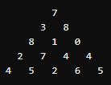

## 정수 삼각형

이렇게 수가 주어졌을때 왼쪽 아래 또는 오른쪽 아래로 이동하면서 선택된 수의 합이 최대가 하라고 한다.

저런 입력이 주어졌을때 답은 30이라고 주어졌다.

처음에는 매 순간 큰 수로 가면 되는거 아니야? 하는 생각이 들었지만

좀 더 생각해 보니 그것은 아님을 알게 되었다

 

그러면 모든 경로를 확인 하되 그 모든 경로를 확인하는 과정을

최대한 간소화 하라는 것(DP) 같은데 어떻게 하면 좋을지 잘 생각이 안난다. 

---

### 정리

두번째 줄의 3을 생각해 본다.

3번째 줄의 8과 1까지 가는 경우를 생각해 볼떄

3을 공통적으로 지난다.

7 -> 3 -> 8

7 -> 3 -> 1

7 -> 8 -> 1

그러면 처음에 8까지 갈때야 7 -> 3 -> 8 아무렇지 않게 이렇게 간다고 치지만

1까지 갈때는 이전에 확인 한 7 -> 3 을 또 지나게 된다.

이런 부분을 메모해놨다가 이용해서 저런 부분을 건너 뛰는 것(반복되는 작업을 생략하는 것)이 다이나믹 프로그래밍(DP)이라고 알고 있다.

그러면 3의 위치는 그 아래쪽 라인의 8과 1로 갈때 무조건 10이 더해진다고 결정지어놓을 수(메모) 있을 것이다.

 

그러면 3번째 줄의 1은 어떨까

아까 3이야 7 하나에서밖에 안오니까 그냥 간단하게 10이라고 확정 했는데

이 1은 3에서 오는경우, 8에서 오는경우 두가지가 있다.

그런데 문제에서 최대값을 구하는 것이므로 두 방향 중 큰 값을 메모해두면 된다. 여기서는 그러니까 7 -> 8 -> 1 : 16를 기록해둬야 하는 것이다.

내 경우에는 이 부분에서 조금 꺠름칙한 부분이 있었는데 조금 생각해보면 당연한 것임을 알게 된다.

10으로 와서 추후 왼쪽, 아래쪽 어디로 가든 15로 와서 어디로 가는 것보다 당연히 항상 작으니 문제 목적에 부합하는 것은 16을 기록해 두는 것이다.

 

이런식으로 각 자리에 다음 줄에 더해줄 가장 큰 수를 기록해 나간다. 그리고 이것이 곧 그 위치까지 오는 경로의 합 중 최대값이다.

이런 값들을 만들어가며 삼각형의 각 자리를 채워 가면,

이를테면 3번째 줄의 1의 자리의 최대값을 채울때

​		     7

​	  10 	     15

18      [1]

[1]의 자리에 10과 15중 큰 수인 15를 골라 1에 더해 16을 채워 넣게 된다.

이렇게 되면 7 + 3과 7 + 8은 아까 두번째 줄에서 10, 15를 만들때 한번만 했고

3번째 줄의 1 자리를 채울때는 이전에 기록해놓은 결과를 가져다 썼음을 알게 된다. 이런게 DP라는것 같다.

 

그러면 이런식으로 각 자리를 채워 가면 결국 맨 마지막 줄에서 최대값이 모든 경로중 최대값이 된다

이제 이 과정을 코드로 구현만 하면 된다.

---

### 풀고 나서

처음에는 정답비율 60%짜리라서 쉬운문젠가보다 하고 본건데 내가 느끼기에는 생각보다 어려웠다.

물론 풀고 나서 보니 문제 자체가 어려웠다고는 할 수 없는것 같지만 다른 풀이를 보고 핵심적인 아이디어를 얻어서 빨리 풀게 된거지

그렇지 않았다면 풀이법을 떠올리는데 훨씬 더 오래 걸렸을 것 같다.

