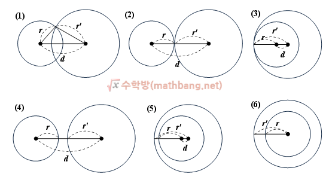

## 터렛

문제는 정리하면 조규현씨와 백승환씨 각각으로부터 상대편 마린(류재명)씨가 있을 수 있는 위치가 원으로 그려지고
상대편 마린(류재명)씨의 위치는 그 두 원 모두에서 해 여야 하므로 두 원의 교점임을 알 수 있다.

그러면 두 원의 교점이 몇개가 될지를 구하는 문제인데 두 원의 교점은 무한개, 2개, 1개, 0개 이렇게 나타날 수 있다.
두 원의 위치 관계에 대한 적절한 자료 발견했다.
(두 원의 위치관계 정보)https://mathbang.net/101

그리고 이것을 친절하게 표로 정리도 해놓으셨다.

여기에 무한 정보만 추가해서 더 정리하면

| 위치관계 | 두점에서 만남             | 한점에서 만남(외접) | 한점에서 만남 (내접) | 안만남(바깥)    | 안만남(안)      | 안만남 (동심원 이면서 r1 != r2) | 무한 (동심원 & r1 == r2) |
| -------- | ------------------------- | ------------------- | -------------------- | --------------- | --------------- | ----------------------------------------- | ----------------------------- |
|          | r1 - r2 < d < r1 + r2 (1) | r1 + r2 == d (2)    | r1 - r2 == d (3)     | r1 + r2 < d (4) | r1 - r2 > d (5) | d == 0 & r1 != r2 (6)                     | d == 0 & r1 == r2             |

이렇게 된다.

이러면 이제 각 조건에 따라 코드를 작성하기만 하면 된다.