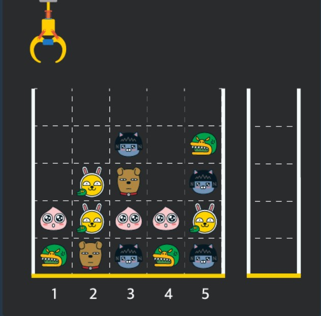
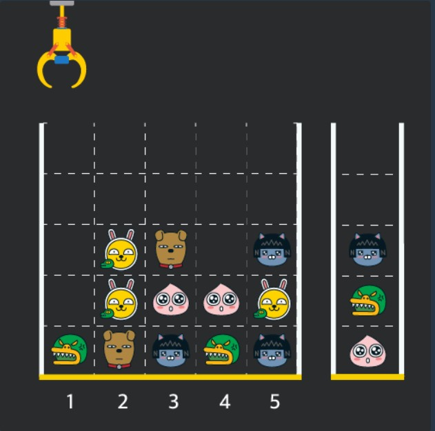
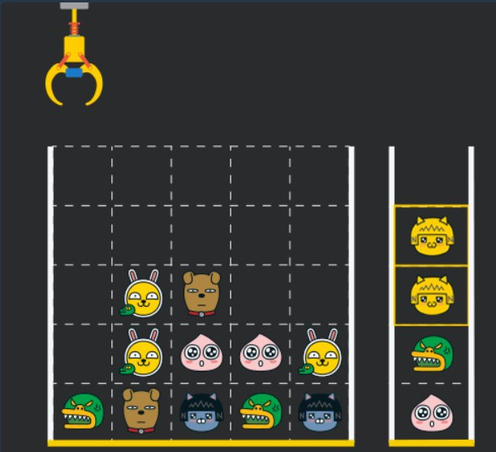

### 문제

***

게임개발자인 "죠르디"는 크레인 인형뽑기 기계를 모바일 게임으로 만들려고 합니다.  
"죠르디"는 게임의 재미를 높이기 위해 화면 구성과 규칙을 다음과 같이 게임 로직에 반영하려고 합니다.  

게임 화면은 "1 x 1" 크기의 칸들로 이루어진 "N x N" 크기의 정사각 격자이며 위쪽에는 크레인이 있고 오른쪽에는 바구니가 있습니다. (위 그림은 "5 x 5" 크기의 예시입니다). 각 격자 칸에는 다양한 인형이 들어 있으며 인형이 없는 칸은 빈칸입니다. 모든 인형은 "1 x 1" 크기의 격자 한 칸을 차지하며 격자의 가장 아래 칸부터 차곡차곡 쌓여 있습니다. 게임 사용자는 크레인을 좌우로 움직여서 멈춘 위치에서 가장 위에 있는 인형을 집어 올릴 수 있습니다. 집어 올린 인형은 바구니에 쌓이게 되는 데, 이때 바구니의 가장 아래 칸부터 인형이 순서대로 쌓이게 됩니다. 다음 그림은 [1번, 5번, 3번] 위치에서 순서대로 인형을 집어 올려 바구니에 담은 모습입니다.

만약 같은 모양의 인형 두 개가 바구니에 연속해서 쌓이게 되면 두 인형은 터뜨려지면서 바구니에서 사라지게 됩니다. 위 상태에서 이어서 [5번] 위치에서 인형을 집어 바구니에 쌓으면 같은 모양 인형 두 개가 없어집니다.

크레인 작동 시 인형이 집어지지 않는 경우는 없으나 만약 인형이 없는 곳에서 크레인을 작동시키는 경우에는 아무런 일도 일어나지 않습니다. 또한 바구니는 모든 인형이 들어갈 수 있을 만큼 충분히 크다고 가정합니다. (그림에서는 화면표시 제약으로 5칸만으로 표현하였음)

게임 화면의 격자의 상태가 담긴 2차원 배열 board와 인형을 집기 위해 크레인을 작동시킨 위치가 담긴 배열 moves가 매개변수로 주어질 때, 크레인을 모두 작동시킨 후 터트려져 사라진 인형의 개수를 return 하도록 solution 함수를 완성해주세요.

[제한사항]

* board 배열은 2차원 배열로 크기는 "5 x 5" 이상 "30 x 30" 이하입니다.

* board의 각 칸에는 0 이상 100 이하인 정수가 담겨있습니다.

  * 0은 빈 칸을 나타냅니다.
  * 1 ~ 100의 각 숫자는 각기 다른 인형의 모양을 의미하며 같은 숫자는 같은 모양의 인형을 나타냅니다.

* moves 배열의 크기는 1 이상 1,000 이하입니다.

* moves 배열 각 원소들의 값은 1 이상이며 board 배열의 가로 크기 이하인 자연수입니다.

  

입출력 예
| board                                                        | moves             | result |
| ------------------------------------------------------------ | ----------------- | ------ |
| [[0,0,0,0,0],[0,0,1,0,3],[0,2,5,0,1],[4,2,4,4,2],[3,5,1,3,1]] | [1,5,3,5,1,2,1,4] | 4      |

입출력 예에 대한 설명
입출력 예 #1

인형의 처음 상태는 문제에 주어진 예시와 같습니다. 크레인이 [1, 5, 3, 5, 1, 2, 1, 4] 번 위치에서 차례대로 인형을 집어서 바구니에 옮겨 담은 후, 상태는 아래 그림과 같으며 바구니에 담는 과정에서 터트려져 사라진 인형은 4개 입니다.

### 풀이

***

인형이 쌓여있는 모습을 나타내는 board와 갈고리의 이동 위치를 나타내는 move가 주어진다  
board를 주어지는 그대로 사용해도 될 것이다  
그런데 numpy의 T가 생각나서 한번 사용해 봤다 T는 전치행렬이다  
이것을 한다고 해서 이 문제에서 큰 의미는 없다  
그냥 move를 열로 두냐 행으로 두냐 차이다  

board를 뒤집어 놓으면 갈고리가 선택한 열 리스트를 좀 더 쉽게 얻을 수 있다  
board를 주어지는 그대로 쓰면 move가 열이다  
2차원 배열에서 특정 열만 따로 빼는 뭔가가 있는지 모르겠다  
물론 그냥 따로 안빼도 된다 그냥 move를 열로 놓고 행을 돌면서 인형을 찾으면 된다  

그리고 내 기억에 numpy에서는 특정 열만 선택할 수 있던 것으로 기억한다  
그러니까 numpy를 쓰더라도 꼭 T를 쓸필요는 없다  

아무튼 전치행렬로 board를 뒤집어놓고 나면 move에 따라  해당하는 부분을 따로 분리하기 용이해진다  
이게 뭐 이득이라고 하기는 좀 그런 것 같고 그냥 내 기준에서는 이쪽이 더 마음에 들어서 이렇게 했다  

이 후로는 문제에서 요구하는 대로 진행하면 된다  
인형을 찾고 바구니에 넣고  
넣었는데 바로 전에 넣은거랑 같은 거면 둘다 없앤다  
두개 없앴으니까 문제에서 찾는 답은 +2 해준다  
인형 찾은 부분은 인형을 뺐으니까 값을 0으로 바꿔준다  
갈고리가 간 곳에 인형이 없으면 아무것도 하지 않는다  

