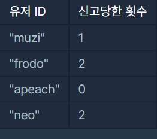
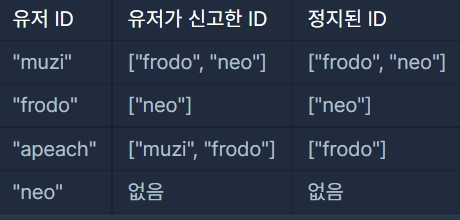

### 문제

신입사원 무지는 게시판 불량 이용자를 신고하고 처리 결과를 메일로 발송하는 시스템을 개발하려 합니다. 무지가 개발하려는 시스템은 다음과 같습니다.  

각 유저는 한 번에 한 명의 유저를 신고할 수 있습니다.  
신고 횟수에 제한은 없습니다. 서로 다른 유저를 계속해서 신고할 수 있습니다.  
한 유저를 여러 번 신고할 수도 있지만, 동일한 유저에 대한 신고 횟수는 1회로 처리됩니다.  
k번 이상 신고된 유저는 게시판 이용이 정지되며, 해당 유저를 신고한 모든 유저에게 정지 사실을 메일로 발송합니다.  
유저가 신고한 모든 내용을 취합하여 마지막에 한꺼번에 게시판 이용 정지를 시키면서 정지 메일을 발송합니다.  
다음은 전체 유저 목록이 ["muzi", "frodo", "apeach", "neo"]이고, k = 2(즉, 2번 이상 신고당하면 이용 정지)인 경우의 예시입니다.  
  
#### 유저 ID	유저가 신고한 ID	설명  
  
각 유저별로 신고당한 횟수는 다음과 같습니다.  
  
#### 유저 ID	신고당한 횟수  
  
위 예시에서는 2번 이상 신고당한 "frodo"와 "neo"의 게시판 이용이 정지됩니다. 이때, 각 유저별로 신고한 아이디와 정지된 아이디를 정리하면 다음과 같습니다.  
  
#### 유저 ID	유저가 신고한 ID	정지된 ID  
  
  
이용자의 ID가 담긴 문자열 배열 id_list, 각 이용자가 신고한 이용자의 ID 정보가 담긴 문자열 배열 report, 정지 기준이 되는 신고 횟수 k가 매개변수로 주어질 때, 각 유저별로 처리 결과 메일을 받은 횟수를 배열에 담아 return 하도록 solution 함수를 완성해주세요.  
  
#### 제한사항  
   

#### 입출력 예   
  
  
#### 입출력 예 설명  
#### 입출력 예 #1  
문제의 예시와 같습니다.  
  
#### 입출력 예 #2  
"ryan"이 "con"을 4번 신고했으나, 주어진 조건에 따라 한 유저가 같은 유저를 여러 번 신고한 경우는 신고 횟수 1회로 처리합니다. 따라서 "con"은 1회 신고당했습니다. 3번 이상 신고당한 이용자는 없으며, "con"과 "ryan"은 결과 메일을 받지 않습니다. 따라서 [0, 0]을 return 합니다.  
  
  
***
### 풀이

문제에서 말하기를  
어떤 게시판이 있는데 이 게시판에서는 k번 이상 신고 당하면 정지가 되고  
누군가가 k번 이상 신고 당해서 게시판 이용이 정지 되면  
그 누군가를 신고한 모두에게 당신이 신고한 사람이 정지되었다고 알람 메일이 간다고 한다  
  
그리고 문제에서 요구하는 것은  
* 유저 목록 (id_list)
* 각 유저들이 누구를 신고했는지를 보여주는 목록 (report)
* 신고 제한 횟수 (k)  
  
가 주어졌을 때 각 유저가 그 알람 메일을 몇개나 받는지 확인하라는 것이다.

  

그러면 문제 자체는 비교적 간단하다  
  
각 사람 별로 몇 번 신고당했는지를 확인할만한 무언가를 만들고  
그 정보를 바탕으로 각 사람이 k번 이상 신고당했는지를 확인 하고  
k번 이상 신고 당했다면 해당 사람을 신고한 사람들의 알람 메일 수신 횟수를 +1 해주면 된다.  
  
이것을 코드로 구현하면 된다.  
  
그래도 한가지 주의할만한 점이라면  
문제에서 한 사람이 누군가를 여러번 신고할 수 없다는 조건 때문에 report에서 중복을 제거해야 하는데  
이 중복 제거 과정에서 list, in 같은 것을 사용해서 제거하다 보면 시간복잡도가 문제가 된다.  
set을 사용해서 단번에 중복을 제거하도록 한다  

  

  

  
