### 문제

나만의 카카오 성격 유형 검사지를 만들려고 합니다.
성격 유형 검사는 다음과 같은 4개 지표로 성격 유형을 구분합니다. 성격은 각 지표에서 두 유형 중 하나로 결정됩니다.

#### 지표 번호	성격 유형  
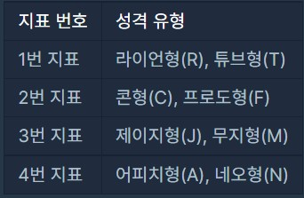  
4개의 지표가 있으므로 성격 유형은 총 16(=2 x 2 x 2 x 2)가지가 나올 수 있습니다. 예를 들어, "RFMN"이나 "TCMA"와 같은 성격 유형이 있습니다.

검사지에는 총 n개의 질문이 있고, 각 질문에는 아래와 같은 7개의 선택지가 있습니다.  

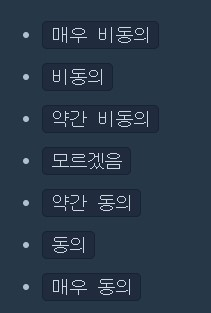  
각 질문은 1가지 지표로 성격 유형 점수를 판단합니다.

예를 들어, 어떤 한 질문에서 4번 지표로 아래 표처럼 점수를 매길 수 있습니다.  

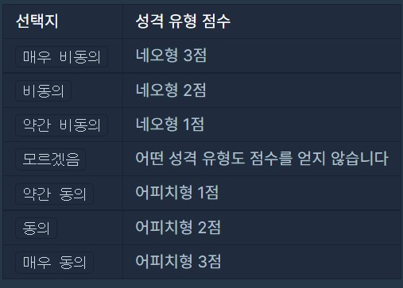  
이때 검사자가 질문에서 약간 동의 선택지를 선택할 경우 어피치형(A) 성격 유형 1점을 받게 됩니다. 만약 검사자가 매우 비동의 선택지를 선택할 경우 네오형(N) 성격 유형 3점을 받게 됩니다.
  
위 예시처럼 네오형이 비동의, 어피치형이 동의인 경우만 주어지지 않고, 질문에 따라 네오형이 동의, 어피치형이 비동의인 경우도 주어질 수 있습니다.
하지만 각 선택지는 고정적인 크기의 점수를 가지고 있습니다.  

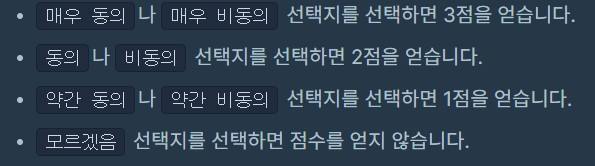  
검사 결과는 모든 질문의 성격 유형 점수를 더하여 각 지표에서 더 높은 점수를 받은 성격 유형이 검사자의 성격 유형이라고 판단합니다. 단, 하나의 지표에서 각 성격 유형 점수가 같으면, 두 성격 유형 중 사전 순으로 빠른 성격 유형을 검사자의 성격 유형이라고 판단합니다.

질문마다 판단하는 지표를 담은 1차원 문자열 배열 survey와 검사자가 각 질문마다 선택한 선택지를 담은 1차원 정수 배열 choices가 매개변수로 주어집니다. 이때, 검사자의 성격 유형 검사 결과를 지표 번호 순서대로 return 하도록 solution 함수를 완성해주세요.

#### 제한사항  
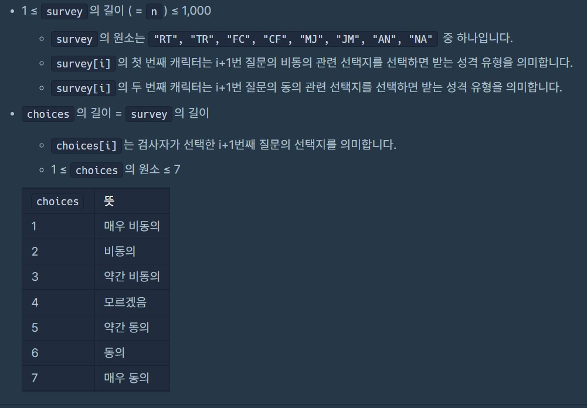  
#### 입출력 예  
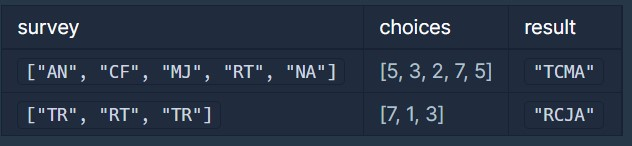  
#### 입출력 예 설명
#### 입출력 예 #1

1번 질문의 점수 배치는 아래 표와 같습니다.

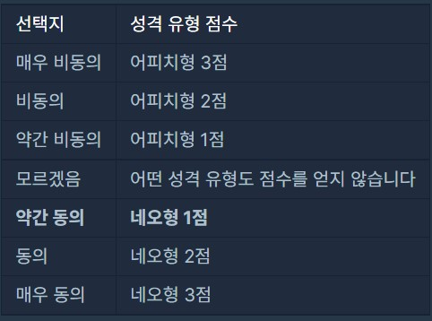  
1번 질문에서는 지문의 예시와 다르게 비동의 관련 선택지를 선택하면 어피치형(A) 성격 유형의 점수를 얻고, 동의 관련 선택지를 선택하면 네오형(N) 성격 유형의 점수를 얻습니다.
1번 질문에서 검사자는 약간 동의 선택지를 선택했으므로 네오형(N) 성격 유형 점수 1점을 얻게 됩니다.

2번 질문의 점수 배치는 아래 표와 같습니다.

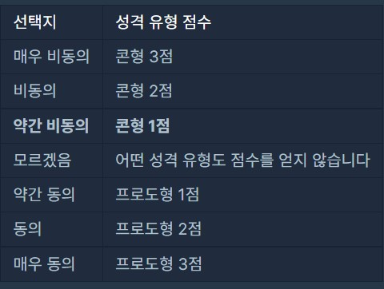  
2번 질문에서 검사자는 약간 비동의 선택지를 선택했으므로 콘형(C) 성격 유형 점수 1점을 얻게 됩니다.

3번 질문의 점수 배치는 아래 표와 같습니다.

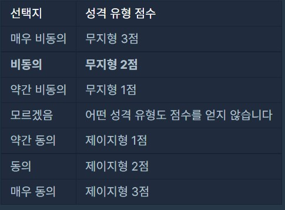  
3번 질문에서 검사자는 비동의 선택지를 선택했으므로 무지형(M) 성격 유형 점수 2점을 얻게 됩니다.

4번 질문의 점수 배치는 아래 표와 같습니다.

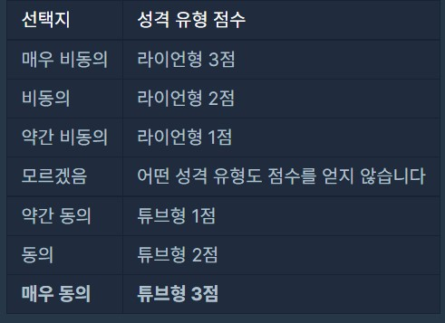  
4번 질문에서 검사자는 매우 동의 선택지를 선택했으므로 튜브형(T) 성격 유형 점수 3점을 얻게 됩니다.

5번 질문의 점수 배치는 아래 표와 같습니다.

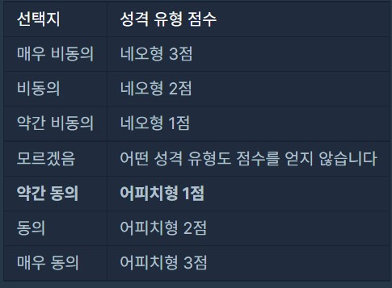  
5번 질문에서 검사자는 약간 동의 선택지를 선택했으므로 어피치형(A) 성격 유형 점수 1점을 얻게 됩니다.

1번부터 5번까지 질문의 성격 유형 점수를 합치면 아래 표와 같습니다.

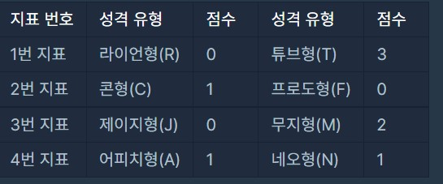  
하지만, 4번 지표는 1점으로 동일한 점수입니다. 따라서, 4번 지표의 성격 유형은 사전순으로 빠른 A입니다.

따라서 "TCMA"를 return 해야 합니다.

#### 입출력 예 #2

1번부터 3번까지 질문의 성격 유형 점수를 합치면 아래 표와 같습니다.

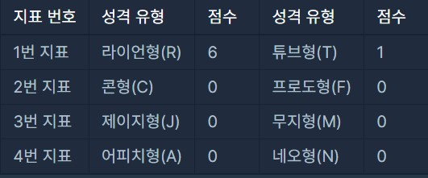  
1번 지표는 튜브형(T)보다 라이언형(R)의 점수가 더 높습니다. 따라서 첫 번째 지표의 성격 유형은 R입니다.
하지만, 2, 3, 4번 지표는 모두 0점으로 동일한 점수입니다. 따라서 2, 3, 4번 지표의 성격 유형은 사전순으로 빠른 C, J, A입니다.

따라서 "RCJA"를 return 해야 합니다.
  
***
### 풀이
문제는 비교적 간단하다  
  
이런 성격 유형이 있다고 할 때  
피검자에게 R이냐 T냐  
C냐 F냐
J냐 M이냐  
A냐 N이냐  
질문을 하는게 survey고  
그에대한 피검자의 답이 choices 이다  
  
그리고 choice는 4를 기준으로 그 아래쪽은 앞쪽 유형이 4 - choice의 점수를 얻고  
4 위쪽은 뒤쪽 유형이 choice - 4의 점수를 얻는다  
ex)  
RT : 5면 T 유형이 1 (5-4)점을,  
RT : 2면 R 유형이 2 (4-2)점을 얻는다
  
그런데 최종적으로 출력해야하는 성격 유형은
1(RT),2(CF),3(JM),4(AN) 유형 순서대로 정렬을 해야한다  
  
그런데 survey는 그런 순서에 상관 없이 주어지기 때문에  
choices에 따라 선택된 성격 유형을 답으로 만들 때는  
1(RT),2(CF),3(JM),4(AN) 순서에 맞게 정렬 해줘야 한다.  
  
그래서 일단 사용자로부터 점수를 얻은 성격 유형을 따로 뽑아놓은 후  
그것을 1,2,3,4 유형 순서에 맞게 답 문자열에 추가했다  

그리고 어떤 성격 유형에서 양 쪽 타입이 같은 점수를 얻은 경우,  
혹은 애초에 질문이 안주어져서 둘 다 0점으로 같은 경우  
즉 하여간 두 타입의 점수가 같은 경우에는 사전 순으로 빠른 것으로 택하라고 하므로  
각 타입의 앞 쪽 것을 답에 추가하면 된다.  

